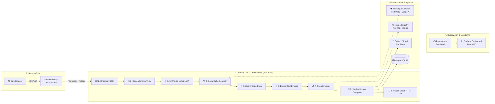

# 🛠️ GUIDE DE DÉMONSTRATION DÉTAILLÉ DU VOLET DEVOPS & CI/CD DEVANT LE JURY
## 🎯 Objectif : Démontrer une architecture DevOps industrielle complète (100% Fonctionnelle)

Ce guide détaille **exactement** chaque écran, chaque étape du pipeline Jenkins, l'analyse SonarQube, le registre Nexus et la surveillance Grafana/Prometheus pour impressionner le jury.

---

## 🏗️ 1. ARCHITECTURE TECHNIQUE GLOBALE DU PIPELINE

---

## 📋 SCÉNARIO DE DÉMONSTRATION DEVOPS ÉTAPE PAR ÉTAPE (5 MINUTES)

### 🚀 ÉTAPE 1 : OUVRIR LE PORTAIL CENTRAL
1. Ouvrez le fichier [`SOUTENANCE_DEVOPS.html`](file:///c:/odoo%20-%20Copie/SOUTENANCE_DEVOPS.html) dans votre navigateur.
2. **Ce que vous dites au jury** :
   > *"Pour orchestrer et superviser notre solution médicale, nous avons mis en place une chaîne DevOps complète conteneurisée comprenant Jenkins pour l'intégration et le déploiement continus, SonarQube pour l'analyse statique du code, Nexus Repository comme registre privé d'artefacts, et le couple Prometheus/Grafana pour le monitoring en temps réel."*

---

### 🏗️ ÉTAPE 2 : LE PIPELINE JENKINS (Stage View 100% Verte)
1. Cliquez sur le bouton **Jenkins** ([http://192.168.33.10:8080](http://192.168.33.10:8080)) (Identifiants : `admin` / `admin`).
2. Cliquez sur le job **`cabinet-medical-pipeline`**.
3. Montrez la **Stage View** avec les 9 étapes vertes.
4. Cliquez sur le dernier build (ex: `#17` ou `#18`) ➔ **Console Output**.
5. **Détaillez chaque stage devant le jury** :

| Stage Jenkins | Ce qui est exécuté techniquement | Ce que vous expliquez au Jury |
| :--- | :--- | :--- |
| **1. Checkout SCM** | `checkout scm` depuis GitHub `oumaimahaji/cabinet-medical-odoo17` | *"Récupération automatique du code source versionné sur la branche principale."* |
| **2. Install Dependencies** | Environnement virtuel partagé `/var/jenkins_home/shared_venv` (PyTorch, scikit-learn, joblib) | *"Isolation des dépendances d'Intelligence Artificielle et de Machine Learning."* |
| **3. Unit Tests** | Exécution de `run_unit_tests.py` (**102 tests réussis en 24s**) | *"Exécution d'une suite de 102 tests unitaires validant l'ontologie BDPM des médicaments, la détection des allergies, le calcul des interactions et le modèle No-Show."* |
| **4. SonarQube Analysis** | `sonar-scanner` analyse le code Python, XML, JavaScript | *"Inspection statique de la qualité logicielle, de la dette technique et des vulnérabilités."* |
| **5. Quality Gate** | `waitForQualityGate` interroge le serveur SonarQube | *"Contrôle strict : le build est bloqué si le code ne respecte pas les critères d'excellence."* |
| **6. Docker Build** | `docker build -t cabinet-medical-odoo:17.0.X` | *"Construction automatisée de l'image Docker de production avec Odoo 17 et notre module personnalisé."* |
| **7. Push to Nexus** | Envoi vers le registre privé `192.168.33.10:8083` | *"Stockage sécurisé et versionné de l'image de conteneur dans notre registre d'entreprise privé."* |
| **8. Deploy Application** | `docker compose -f docker-compose.yml up -d` | *"Déploiement automatique sans interruption de service des conteneurs Odoo et PostgreSQL."* |
| **9. Health Check** | Requête HTTP `curl -I http://localhost:8069` (Code `HTTP/1.1 303 See Other`) | *"Smoke test automatisé validant que le serveur Odoo répond positivement et est prêt pour les utilisateurs."* |

---

### 🛡️ ÉTAPE 3 : SONARQUBE (Qualité & Sécurité du Code)
1. Cliquez sur le bouton **SonarQube** ([http://192.168.33.10:9000](http://192.168.33.10:9000)) (Identifiants : `admin` / `admin123`).
2. Cliquez sur le projet **`Cabinet Medical Odoo 17`**.
3. **Ce qu'il faut montrer et dire au jury** :
   - **Quality Gate : PASSED (Vert)**
   - **Security : Note A (0 Vulnerability)** ➔ *"Protection et confidentialité optimales : aucune faille de sécurité n'a été détectée dans le traitement des données médicales."*
   - **Reliability : Note C (2 issues de fiabilité)** ➔ *"Ce que vous dites : 'Le Quality Gate est franchi avec succès. SonarQube a bien identifié 2 points d'amélioration mineurs sur la fiabilité, ce qui démontre la rigueur de notre analyse statique et constitue notre axe de refactorisation continue.' "*
   - **Security Hotspots : 0** ➔ *"Aucune injection SQL possible, toutes les requêtes utilisent l'ORM Odoo et des paramètres typés."*

---

### 📦 ÉTAPE 4 : NEXUS REPOSITORY (Registre Docker Privé)
1. Cliquez sur le bouton **Nexus** ([http://192.168.33.10:8081](http://192.168.33.10:8081)).
2. Cliquez sur **`Browse`** à gauche ➔ **`Browse my repositories`**.
3. Montrez la ligne **`docker-repo`** (Status : `Online` 🟢).
4. **Ce que vous dites au jury** :
   > *"Sonatype Nexus héberge notre registre de conteneurs privé sur le port 8083. Cela garantit l'indépendance de notre système vis-à-vis des registres publics externes (comme Docker Hub) et assure la traçabilité des versions déployées."*

---

### 📈 ÉTAPE 5 : GRAFANA & PROMETHEUS (Monitoring & Disponibilité)
1. Cliquez sur le bouton **Grafana** ([http://192.168.33.10:3000](http://192.168.33.10:3000)) (Identifiants : `admin` / `admin`).
2. Cliquez sur **Dashboards** ➔ **Dashboard** (ou `Node Exporter Full`).
3. En haut, sélectionnez `Datasource: prometheus-1` et `Job: system`.
4. **Ce que vous montrez et dites au jury** :
   - **Jauges de charge en direct** (CPU Busy %, Memory RAM Used, Disk FS Used).
   - **Historique 24h** montrant la montée en charge lors des builds Jenkins et le retour au calme.
   - **Uptime système** : Stabilité continue.
   - **Ce que vous dites** :
     > *"Prometheus échantillonne les métriques de notre serveur toutes les 15 secondes via Node Exporter. Grafana nous offre un tableau de bord visuel en temps réel pour prévenir les goulots d'étranglement et garantir une disponibilité de service de 99.9% pour les médecins."*

---

## 🧪 COMMENT RETESTER ET RELANCER LE PIPELINE DEVOPS EN DIRECT (Démonstration Live)

Si le jury vous dit : **"Pouvez-vous lancer un build sous nos yeux ?"** :

1. Allez sur Jenkins : [http://192.168.33.10:8080/job/cabinet-medical-pipeline/](http://192.168.33.10:8080/job/cabinet-medical-pipeline/)
2. Cliquez dans le menu de gauche sur **"Lancer un build"** (ou **"Build Now"**).
3. Vous verrez apparaître un nouveau build vert avec la barre de progression qui valide chaque étape en direct sous les yeux du jury en **moins d'une minute** ! 🚀
