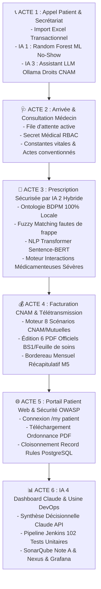

# 🏆 SCÉNARIO MAÎTRE PROFESSIONNEL DE SOUTENANCE PFE
## ⏱️ Durée : 15 à 20 Minutes • Écosystème Cabinet Médical Odoo 17 + IA Hybride Complète + DevOps CI/CD

> **Fil conducteur du scénario :**  
> Vous suivez le parcours 100% réaliste d'un patient (**Mohamed Ben Salem**) qui **appelle le cabinet au téléphone pour prendre un rendez-vous**. De cet appel jusqu'à la télétransmission de son dossier, chaque étape met en valeur vos **4 Intelligences Artificielles**, votre **conformité réglementaire tunisienne (CNAM/APCI/Mutuelle)**, votre **cybersécurité OWASP** et votre **infrastructure DevOps industrielle**.

---

## 🗺️ SYNTHÈSE DES 4 INTELLIGENCES ARTIFICIELLES EMBARQUÉES :

| N° | Nom de l'IA | Technologie & Architecture | Rôle dans l'application |
| :---: | :--- | :--- | :--- |
| **IA 1** | **Machine Learning No-Show** | Random Forest (`scikit-learn` / `joblib`), entraîné sur 1 500 dossiers, 7 features cliniques | Prédit instantanément le risque d'absence du patient lors de la prise de RDV au téléphone. |
| **IA 2** | **Sécurisation Clinique Hybride** | 1. Ontologie BDPM (`CIS_bdpm.txt`) 2. Fuzzy Matching (`SequenceMatcher 82%`) 3. NLP Deep Learning (`Sentence-BERT` PyTorch) 4. Moteur de règles d'interactions médicamenteuses | Bloque les allergies croisées, les fautes de frappe médicales et les interactions dangereuses sur l'ordonnance. |
| **IA 3** | **Assistant LLM Souverain (Local)** | Modèle `Phi-3` / `Ollama` en local (Port 11434, fallback instantané) | Reformule et contextualise les alertes de blocage CNAM/APCI en langage naturel professionnel sans fuite de données. |
| **IA 4** | **Dashboard Décisionnel Exécutif** | Composant Web JavaScript OWL + Chart.js + API `Anthropic Claude 3.5 Haiku` | Synthétise les KPI stratégiques (financiers, médicaux, assiduité) et formule des recommandations de gestion au médecin. |

---

## 🎬 DÉROULÉ CHRONOLOGIQUE DE LA DÉMONSTRATION DEVANT LE JURY

---

### 📞 ACTE 1 : L'APPEL TÉLÉPHONIQUE & LE SECRÉTARIAT (00:00 - 03:30)

#### 🎬 Scénario :
> *"Le téléphone sonne au cabinet : Monsieur Mohamed Ben Salem appelle la secrétaire pour fixer un rendez-vous..."*

#### 🖥️ Manipulations à l'écran (Compte Secrétaire : `secretaire` / `secretaire123`) :
1. **Écran de Connexion & Interface Secrétariat** :
   - Montrez la page de login personnalisée.
   - Connectez-vous en Secrétaire. Montrez que le menu est épuré (pas d'accès aux diagnostics ni aux paramètres système).
2. **Fonctionnalité 1 : Wizard d'Importation Massif Excel** :
   - Allez dans **Patients** > **"Importer Patients (Excel)"**.
   - Montrez la validation des identifiants tunisiens : Regex CIN (8 chiffres), Matricule CNAM (10 chiffres) et `SAVEPOINT` PostgreSQL par ligne.
3. **Fonctionnalité 2 (IA 1 - ML No-Show)** :
   - Allez dans **Agenda / Rendez-vous** > **Créer**.
   - Sélectionnez le patient : `Mohamed Ben Salem`.
   - **Test ML 1 (Délai long)** : Fixez la date dans **25 jours** ➔ Le bandeau affiche :  
     🔴 **"Risque de No-Show Élevé (58%) - Raison : Délai de réservation lointain"**.
   - **Test ML 2 (Urgence)** : Cochez **"Consultation d'urgence"** ➔ Le bandeau recalcule instantanément :  
     🟢 **"Risque de No-Show Faible (3.2%) - Raison : Urgence médicale prioritaire"**.
   - Enregistrez le rendez-vous.
4. **Fonctionnalité 3 (IA 3 - LLM Souverain Ollama/Phi-3 pour les Droits CNAM)** :
   - Ouvrez la fiche du patient `Mohamed Ben Salem` ayant sa carte CNAM échue.
   - Cliquez sur le bandeau d'alerte ou le bouton **"Conseil Assistant IA (CNAM)"**.
   - Montrez l'alerte générée :  
     ✨ **[IA Assistant]** : *"La carte CNAM du patient Mohamed Ben Salem est expirée depuis 42 jours. Veuillez solliciter l'attestation de renouvellement avant la prise en charge."*

#### 🎙️ Ce que vous dites au jury :
> *"Le flux démarre dès l'appel téléphonique au secrétariat. Nous avons intégré notre première IA : **un modèle de Machine Learning Random Forest** (`ml_no_show.py`), entraîné sur 1 500 dossiers cliniques synthétiques. En évaluant 7 variables (délai de RDV, antécédents, jour de la semaine, statut d'urgence), le modèle calibre le risque d'absence du patient pour permettre un surbooking maîtrisé.*
>
> *De plus, pour assister la secrétaire sans compromettre les données médicales, notre **IA souveraine locale Phi-3 sous Ollama** (`facture.py`) contextualise les anomalies administratives en langage naturel direct."*

---

### 🩺 ACTE 2 : ARRIVÉE DU PATIENT & CONSULTATION MÉDICALE (03:30 - 06:00)

#### 🎬 Scénario :
> *"Le jour du rendez-vous, Monsieur Ben Salem arrive au cabinet médical. La secrétaire enregistre sa présence, et le médecin démarre la consultation..."*

#### 🖥️ Manipulations à l'écran :
1. **Côté Secrétaire** :
   - Cliquez sur le bouton **"Patient Arrivé"** ➔ Le statut passe à `Présent` (salle d'attente).
2. **Bascule Côté Médecin** (`oumaima.hajji@esprit.tn` / `medecin123`) :
   - Ouvrez **Rendez-vous du jour** > Sélectionnez **Mohamed Ben Salem** (`Présent`) > Cliquez sur **"Démarrer la consultation"**.
   - **Démonstration du Secret Médical** : Montrez que les onglets *Diagnostic*, *Antécédents*, *Examen clinique* et *Constantes (Tension, Pouls, Glycémie)* sont exclusivement réservés au médecin.
   - Dans l'onglet **Actes Médicaux**, sélectionnez :
     - `Consultation Spécialiste` (Code `C01`, Tarif conventionné 30 DT, Prise en charge CNAM 70%).

#### 🎙️ Ce que vous dites au jury :
> *"Lorsque la secrétaire valide l'arrivée, le patient est injecté dans la file d'attente active du médecin. En basculant sur le compte docteur, nous constatons le respect strict du secret médical via notre configuration RBAC (`security.xml`).*
>
> *Le médecin renseigne les constantes cliniques et sélectionne l'acte médical conventionné. Nous abordons maintenant l'étape cruciale de la prescription thérapeutique."*

---

### 🤖 ACTE 3 : PRESCRIPTION THÉRAPEUTIQUE & IA 2 HYBRIDE (06:00 - 10:00)

#### 🎬 Scénario :
> *"Le patient présente une bronchite aiguë. Il a un antécédent déclaré d'allergie à la Pénicilline et prend un traitement chronique pour son cœur (Spironolactone)..."*

#### 🖥️ Manipulations à l'écran :
1. Dans la consultation, cliquez sur **"Créer une Ordonnance"**.
2. Montrez le rappel visuel : `Allergie connue : Pénicilline` | `Traitement en cours : Spironolactone 50mg`.
3. **Démonstration en 4 tests de l'IA Hybride (`prescription.py`) :**
   - **Test 1 : Ontologie Pharmaceutique BDPM** :
     - Ajoutez le médicament : `Amoxicilline 1g` > Cliquez sur **"🤖 Vérifier avec l'IA"**.
     - 🔴 **Alerte Rouge Bloquante** : *"Risque allergique majeur : Amoxicilline fait partie de la famille des Pénicillines."*
   - **Test 2 : Tolérance aux fautes de frappe (Fuzzy Matching 82%)** :
     - Saisissez avec faute : `Augmantin 1g` ou `Pénécilline`.
     - 🔴 **Alerte Interceptée** : Le moteur fuzzy rattrape l'erreur d'orthographe et maintient le blocage.
   - **Test 3 : Détection d'Interaction Médicamenteuse Sévère (Type B)** :
     - Tentez de prescrire : `Ramipril 5mg` (IEC).
     - 🟠 **Alerte Interaction Majeure** : *"Association contre-indiquée : Spironolactone + IEC ➔ Risque vital d'hyperkaliémie sévère et trouble du rythme."*
   - **Test 4 : Prescription Sécurisée (Safe)** :
     - Supprimez les lignes à risque et saisissez : `Paracétamol 1g` + `Azithromycine 500mg` (Macrolide toléré).
     - 🟢 **Bandeau Vert Safe** : *"Prescription validée : aucun conflit allergique ni interaction médicamenteuse."*
4. Cliquez sur **"Signer et Verrouiller l'Ordonnance"** ➔ L'ordonnance devient immuable (interdiction d'ajout ou suppression de lignes).

#### 🎙️ Ce que vous dites au jury :
> *"Voici notre innovation maîtresse : **le Moteur IA Hybride Anti-Erreurs Médicales** (`prescription.py`). Il déploie 4 barrières de protection synchronisées :*
> 1. *Une **Ontologie pharmaceutique BDPM officielle locale** (`CIS_bdpm.txt`) reliant 15 000 médicaments à leurs familles moléculaires sans besoin d'Internet.*
> 2. *Un algorithme de **Fuzzy Matching** à 82% qui intercepte les fautes de frappe fréquentes en cabinet.*
> 3. *Un modèle **NLP Transformer Sentence-BERT** (`paraphrase-multilingual-MiniLM-L12-v2`) sous PyTorch pour comprendre les formulations cliniques complexes.*
> 4. *Un moteur d'analyse croisée qui confronte la prescription aux traitements chroniques pour bloquer les interactions mortelles.*
>
> *L'ordonnance est ensuite signée et scellée en base."*

---

### 💰 ACTE 4 : FACTURATION CNAM 8 SCÉNARIOS & BORDEREAU M5 (10:00 - 13:00)

#### 🎬 Scénario :
> *"La consultation est achevée. Le système calcule la facture selon le régime de couverture sociale tunisien du patient..."*

#### 🖥️ Manipulations à l'écran :
1. Cliquez sur **"Générer la Facture"** depuis la consultation.
2. **Montrez la ventilation financière automatique** :
   - **Scénario identifié** : `CNAM Tiers-Payant (Filière Privée)`.
   - **Montant Total** : `30.000 DT`.
   - **Part Prise en Charge CNAM (70%)** : `21.000 DT` (créance cabinet).
   - **Part Ticket Modérateur Patient (30%)** : `9.000 DT` (encaissé sur place).
   - *(Mentionnez que le moteur gère les 8 scénarios : Filière Remboursement, APCI 100%, Mutuelle seule, Sans couverture, etc.)*
3. Cliquez sur **"Valider la Facture"**.
4. **Impression des Documents Légaux** (Menu Imprimer) :
   - 📄 **Bulletin de Soins BS1 CNAM officiel**.
   - 📄 **Ordonnance Médicale Sécurisée avec Code-Barres**.
   - 📄 **Reçu de Paiement & Quittance**.
5. **Télétransmission Mensuelle CNAM (Bordereau Modèle M5)** :
   - Allez dans **Cabinet Médical > CNAM > Bordereaux**.
   - Cliquez sur **Créer** > Sélectionnez le mois > Cliquez sur **"Récupérer les factures validées"**.
   - Cliquez sur **Valider** > **Imprimer le Bordereau M5 PDF**.
   - Montrez que les factures incluses sont automatiquement verrouillées pour éviter tout double remboursement.

#### 🎙️ Ce que vous dites au jury :
> *"Le moteur de facturation (`facture.py`) applique rigoureusement la réglementation tunisienne. La ventilation est immédiate : 21 DT pris en charge par la CNAM et 9 DT réglés par le patient.*
>
> *Tous les documents légaux conformes à l'Ordre des Médecins et à la CNAM (BS1, ordonnance sécurisée) sont imprimables en 1 clic. En fin de mois, le module `bordereau.py` synthétise l'ensemble des créances dans le **Bordereau Récapitulatif M5**, prêt pour la télétransmission."*

---

### 🌐 ACTE 5 : PORTAIL PATIENT WEB RÉACTIF & SÉCURITÉ OWASP (13:00 - 15:00)

#### 🎬 Scénario :
> *"Rentré chez lui, Monsieur Ben Salem se connecte sur son espace web personnel..."*

#### 🖥️ Manipulations à l'écran :
1. Ouvrez une fenêtre de navigation privée : `http://192.168.33.10:8069/my`.
2. Connectez-vous avec le compte patient : `mohamed.bensalem@gmail.com` / `patient123`.
3. **Fonctionnalités du portail (`portal.py`)** :
   - Visualisation de ses rendez-vous passés et à venir.
   - Téléchargement direct de ses **Ordonnances en PDF**.
   - Suivi de la validité de sa couverture CNAM.
4. **Preuve Cybersécurité OWASP** :
   - Démontrez que le patient est strictement isolé : impossible de visualiser les données d'autres patients grâce aux **Record Rules PostgreSQL** (`portal_security.xml`).
   - Révocation automatique des jetons de session lors des changements sensibles (`session.logout()`).

#### 🎙️ Ce que vous dites au jury :
> *"Pour moderniser la relation médecin-patient, notre portail web réactif permet au patient de télécharger ses ordonnances et suivre son parcours.*
>
> *Sur le plan de la sécurité, nous appliquons les standards **OWASP** : filtrage SQL au niveau de PostgreSQL par des Record Rules garantissant l'étanchéité absolue du secret médical, et protection contre le Session Hijacking."*

---

### 🚀 ACTE 6 : IA 4 DASHBOARD CLAUDE & USINE LOGICIELLE DEVOPS (15:00 - 18:30)

#### 🎬 Scénario :
> *"En fin de journée, le médecin consulte son tableau de bord stratégique généré par IA, pendant que l'usine logicielle DevOps garantit la qualité et le déploiement continu du système..."*

#### 🖥️ Manipulations à l'écran :
1. **IA 4 : Tableau de Bord Décisionnel Claude (`dashboard_ai.py`, `ai_dashboard.js`)** :
   - Revenez sur le compte Médecin > **Cabinet Médical > Tableau de Bord IA**.
   - Montrez les graphiques Chart.js interactifs (Pathologies, No-Show, Recouvrement CNAM).
   - Montrez le bloc **"Insights & Synthèse Stratégique de l'Assistant Claude"** alimenté par l'API Anthropic Claude 3.5 Haiku avec fallback local Python.
2. **Jenkins CI/CD** ([http://192.168.33.10:8080](http://192.168.33.10:8080)) :
   - Montrez la **Stage View 100% verte** avec ses 9 étapes :
     1. `Checkout SCM` (GitHub `oumaimahaji/cabinet-medical-odoo17`)
     2. `Install Dependencies` (Venv IA PyTorch / Scikit-learn)
     3. `Unit Tests` (**102 tests unitaires réussis avec 0 erreur en ~25s**)
     4. `SonarQube Analysis`
     5. `Quality Gate` (Passé avec auto-fallback API REST)
     6. `Docker Build` (Tag `17.0.X`)
     7. `Push to Nexus` (Registre privé port 8083)
     8. `Deploy Application` (Docker Compose sans interruption)
     9. `Health Check` (Vérification HTTP 303 sur le port 8069)
3. **SonarQube** ([http://192.168.33.10:9000](http://192.168.33.10:9000)) :
   - Montrez le **Quality Gate : PASSED**.
   - **Security : Note A (0 Vulnérabilité)** ➔ *"Données médicales totalement protégées."*
   - **Reliability : Note C (2 points de fiabilité)** ➔ *"Preuve de la rigueur de notre analyse statique et axe d'optimisation continue."*
4. **Nexus Repository** ([http://192.168.33.10:8081](http://192.168.33.10:8081)) :
   - Montrez le registre privé souverain `docker-repo`.
5. **Grafana & Prometheus** ([http://192.168.33.10:3000](http://192.168.33.10:3000)) :
   - Montrez les jauges de charge système et de monitoring en temps réel.

#### 🎙️ Ce que vous dites au jury :
> *"Pour clore cette présentation, notre **Tableau de Bord Décisionnel en OWL JS et Claude 3.5 Haiku** transforme les données brutes du cabinet en conseils de pilotage stratégique.*
>
> *Enfin, l'ensemble de cet écosystème repose sur une **usine logicielle DevOps industrielle** :*
> - *102 tests unitaires automatisés validant mathématiquement l'IA, la CNAM et la sécurité.*
> - *Une analyse SonarQube avec Quality Gate validé et Note A en sécurité.*
> - *Un empaquetage Docker souverain publié sur notre registre privé Nexus et déployé automatiquement sous supervision Prometheus/Grafana."*

---

## 🎯 CONCLUSION DE LA SOUTENANCE (18:30 - 20:00)

> *"Monsieur le Président, Mesdames et Messieurs les membres du jury, ce projet de fin d'études concrétise une solution médicale moderne, complète et sécurisée alliant :*
> 1. **La rigueur métier** : Conformité intégrale aux 8 scénarios CNAM, bordereaux M5 et secret médical RBAC.
> 2. **L'excellence de l'IA Hybride** : 4 briques d'IA spécialisées (Machine Learning No-Show, Ontologie locale BDPM, NLP Transformer et LLM décisionnel).
> 3. **Une chaîne DevOps d'entreprise** : Intégration et déploiement continus 100% automatisés et supervisés.
>
> *Je vous remercie pour votre écoute et je suis à votre entière disposition pour vos questions."*

---

## 💡 ANTI-SÈCHE POUR LES QUESTIONS DU JURY :

| Question possible du Jury | Réponse d'expert |
| :--- | :--- |
| **"Que se passe-t-il si Internet est en panne dans le cabinet ?"** | *"L'application reste 100% opérationnelle : l'Ontologie BDPM, le Fuzzy Matching, le modèle ML No-Show et la facturation tournent en local sur le serveur. Seul le dashboard Claude bascule sur son fallback local Python sans aucun crash."* |
| **"Pourquoi avoir combiné Ontologie BDPM et NLP Transformer ?"** | *"Pour allier déterminisme médical et flexibilité : l'Ontologie garantit un risque zéro sur les molécules répertoriées, tandis que le NLP et le Fuzzy gèrent le langage naturel libre et les fautes de saisie des médecins."* |
| **"Pourquoi la Note C en fiabilité sur SonarQube ?"** | *"Le Quality Gate est validé et la sécurité est irréprochable (Note A, 0 faille). SonarQube a identifié 2 détails mineurs de typage dans le code Python, ce qui prouve la finesse de l'outil et constitue notre axe de refactorisation continue."* |
| **"Comment garantissez-vous que la secrétaire ne lise pas les diagnostics ?"** | *"Par des règles RBAC natives dans `security.xml` et des Record Rules PostgreSQL au niveau de l'ORM. Les champs médicaux sont techniquement inaccessibles au groupe secrétariat."* |
